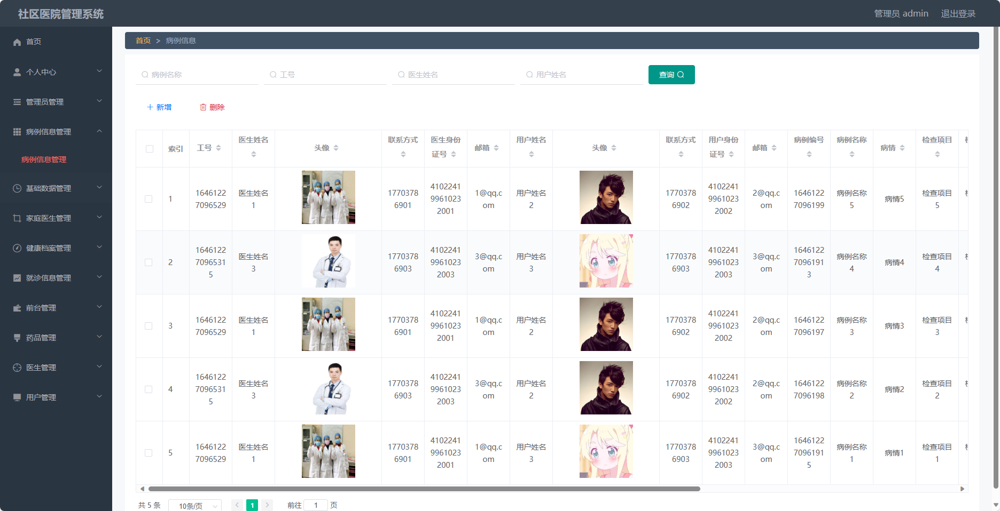
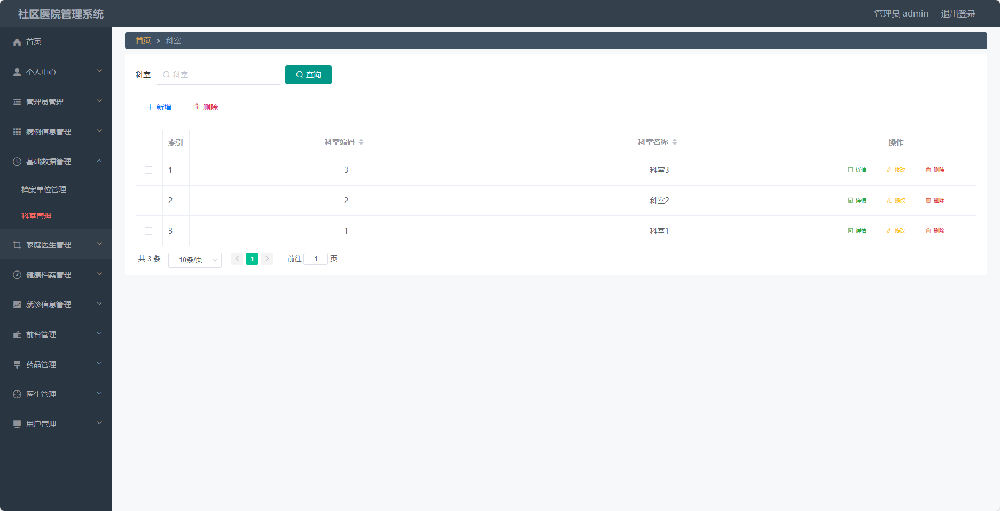
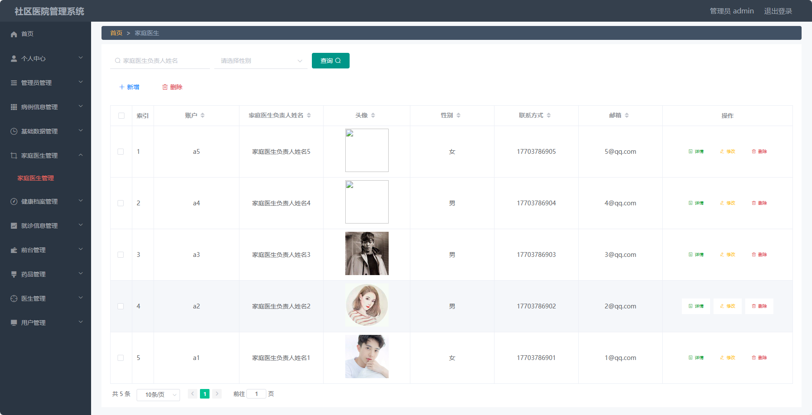
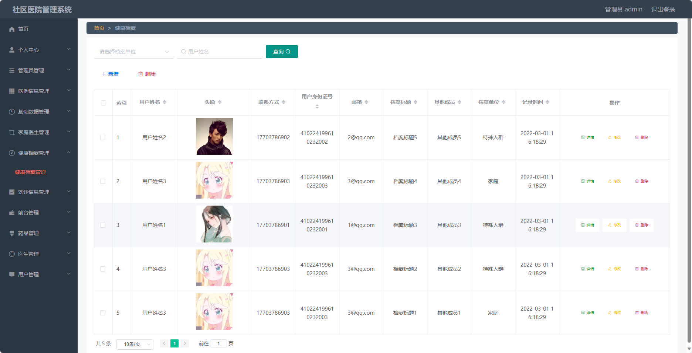
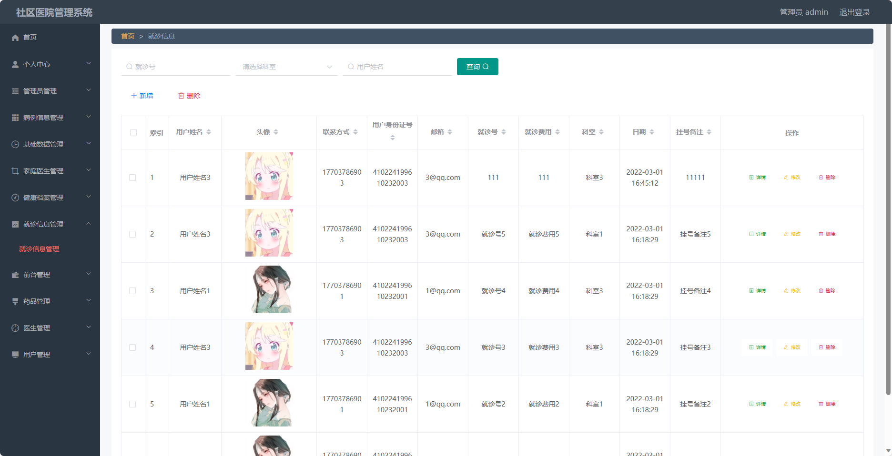
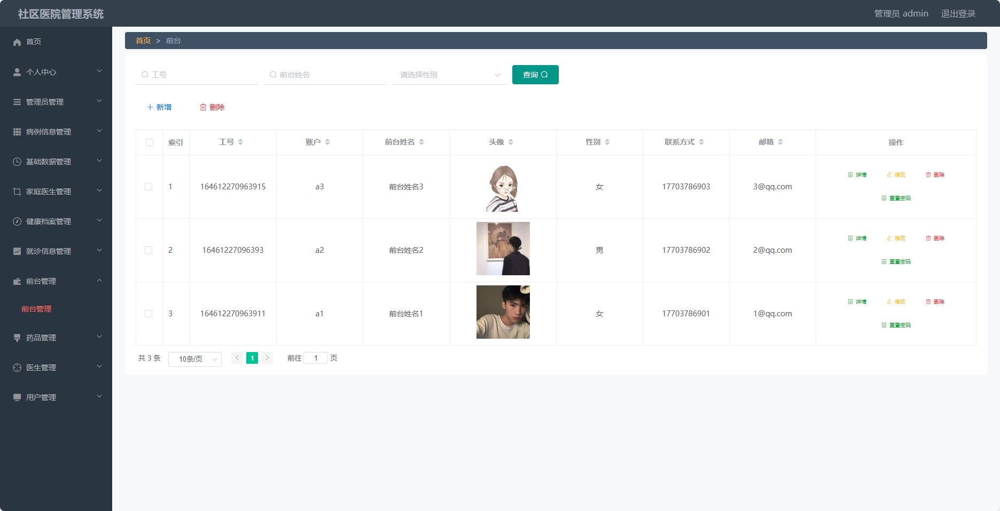
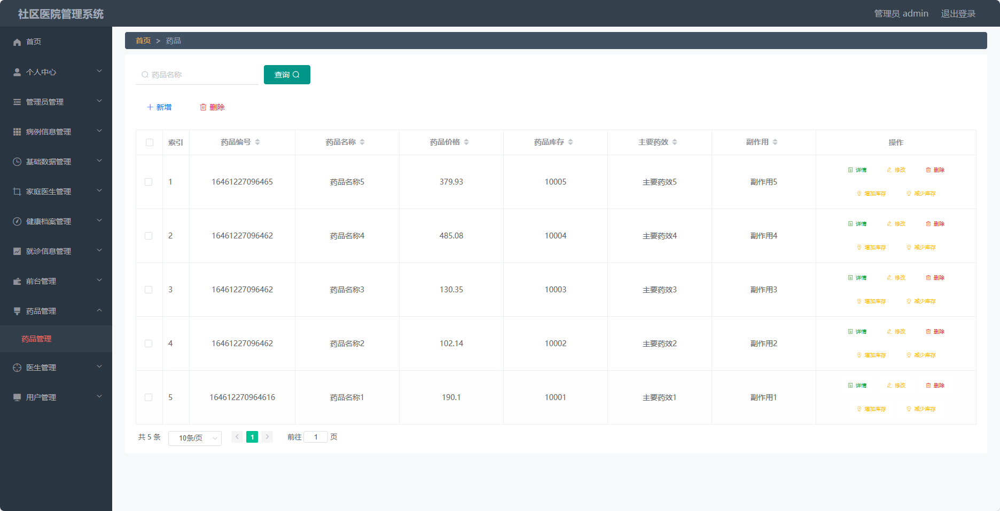
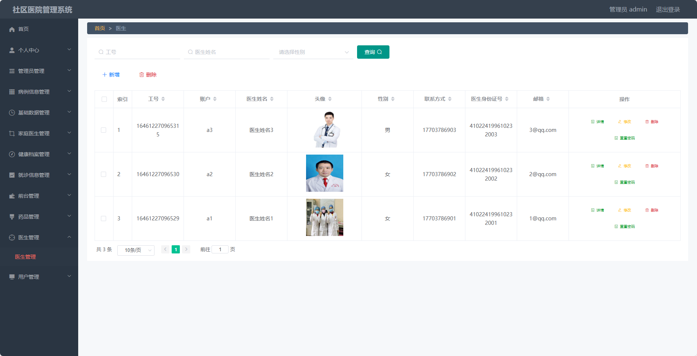
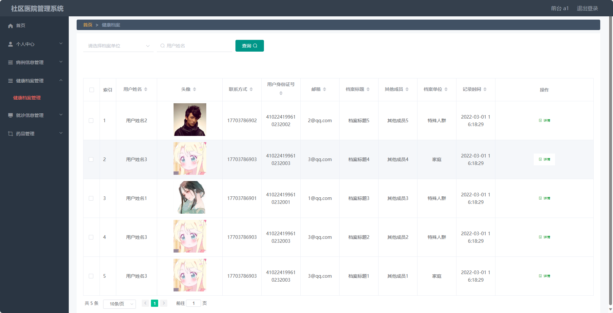

## 基于SpringBoot的社区医院管理系统(程序+报告)

###  获取sql数据库文件: 从戎源码网 (https://armycodes.com/) QQ: 386869957 QQ群: 377586148
###  所有系统地址: (https://github.com/YuLin-Coder/AllProjectCatalog) 
###  所有项目以及源代码本人均调试运行无问题 可支持远程安装部署调试、定制修改、代码讲解

## 项目介绍
基于SpringBoot的社区医院管理系统，系统包含四种角色：管理员、前台、医生、用户,系统分为前台和后台两大模块，主要功能如下。

### 【管理员】:
- 个人中心：管理个人信息。
- 管理员管理：管理系统管理员的基本信息。
- 病例信息管理：管理患者的病例信息。
- 基础数据管理：管理系统的基础数据信息。
- 家庭医生管理：管理家庭医生的基本信息。
- 健康档案管理：管理患者的健康档案信息。
- 就诊信息管理：管理就诊信息和患者的病历等相关信息。
- 前台管理：管理前台工作人员的基本信息。
- 药品管理：管理医院药品库存信息。

### 【前台】:
- 个人中心：管理个人信息。
- 病例信息管理：管理患者的病例信息。
- 健康档案管理：管理患者的健康档案信息。
- 就诊信息管理：管理就诊信息和患者的病历等相关信息。
- 药品管理：管理药品的基本信息。

### 医生：
- 个人中心：管理个人信息。
- 病例信息管理：管理患者的病例信息。
- 健康档案管理：管理患者的健康档案信息。
- 就诊信息管理：管理就诊信息和患者的病历等相关信息。
- 药品管理：管理药品的基本信息。

### 用户：
- 个人中心：管理个人信息。
- 病例信息管理：管理个人的病例信息。
- 家庭医生管理：管理家庭医生的基本信息。
- 健康档案管理：管理个人的健康档案信息。
- 就诊信息管理：管理就诊信息和个人的病历等相关信息。
- 药品管理：管理个人用药信息。

## 项目技术
- 编程语言：Java
- 数据库：MySQL
- 项目管理工具：Maven
- 前端技术：HTML、CSS、JavaScript、Jquery、Vue
- 后端技术：Spring、SpringMVC、MyBatis

## 运行环境
- JDK版本：JDK1.8及以上
- 开发工具：IDEA、Ecplise、Myecplise都可以
- 数据库: MySQL5.7及以上
- Maven：maven3.0及以上
- Node：14.14.0及以上

## 运行截图

